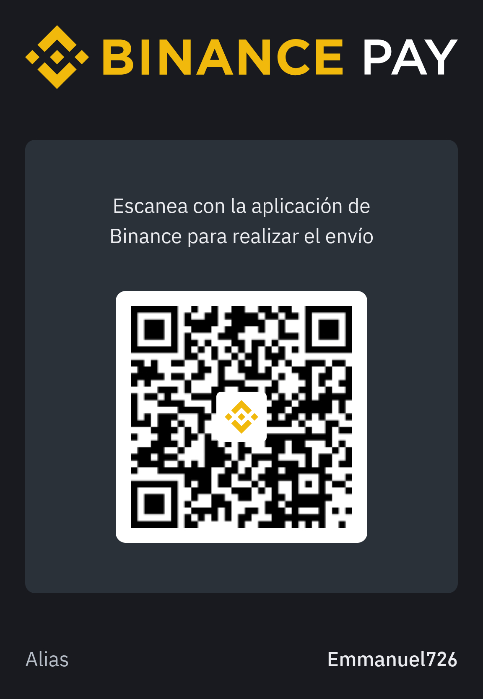

# 🧾 Sistema de Login y Registro - Login & Register System (Reflex)


Este es un sistema de autenticación simple (login y registro de usuarios) creado con [Reflex](https://reflex.dev), un moderno framework full-stack en Python para construir interfaces web interactivas.

This is a simple authentication system (user login and registration) built with [Reflex](https://reflex.dev), a modern full-stack Python framework for building interactive web interfaces.

---

## 🚀 Instalación / Installation

### 📌 Requisitos / Requirements

- Python 3.10+
- Git
- Virtualenv (opcional, pero recomendado)

---

### 🛠️ Pasos para correr el proyecto / Steps to run the project

#### 🇪🇸 En Español:

```bash
# 1. Clona el repositorio
git clone https://github.com/Emmanuel726/Login.git
cd Login

# 2. Crea y activa un entorno virtual (opcional pero recomendado)
python -m venv venv
source venv/bin/activate   # En Windows: venv\Scripts\activate

# 3. Instala Reflex
pip install reflex

# 4. Instala las dependencias del proyecto (si aplica)
# reflex automáticamente las gestiona al correr el proyecto

# 5. Ejecuta el servidor
reflex run

# 6. Abre tu navegador en http://localhost:3000
```

#### 🇺🇸 In English:
```bash
# 1. Clone the repository
git clone https://github.com/Emmanuel726/Login.git
cd Login

# 2. Create and activate a virtual environment (optional but recommended)
python -m venv venv
source venv/bin/activate   # On Windows: venv\Scripts\activate

# 3. Install Reflex
pip install reflex

# 4. Install project dependencies (if applicable)
# reflex manages them automatically when running the project

# 5. Run the server
reflex run

# 6. Open your browser at http://localhost:3000
```
---

## 🧩 Funcionalidades / Features

  ✅ Registro de nuevos usuarios / User registration

  ✅ Inicio de sesión seguro / Secure login

  ✅ Validaciones en el frontend y backend / Frontend and backend validations

  ✅ Estilo limpio y responsivo / Clean and responsive design

---

# 🫶 Apóyame / Support Me
Si este proyecto te fue útil y quieres apoyar su desarrollo, considera hacer una donación. ¡Cualquier ayuda es muy apreciada! 🙏

If this project helped you and you'd like to support its development, feel free to make a donation. Any support is greatly appreciated! 🙏

# 💳 Donaciones / Donations

<div align="center">
    
</div>

## 📫 Contacto / Contact

Autor / Author: Emmanuel Perez

Email: perezemmanuel726@gmail.com

